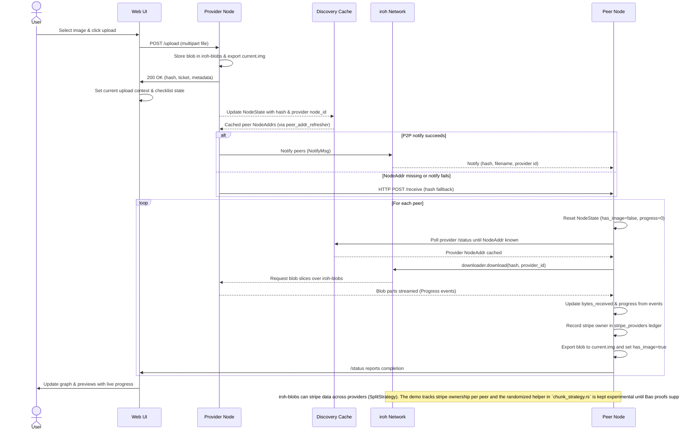

# Emerald Image Mesh Flow

```mermaid
sequenceDiagram
    actor U as User
    participant UI as Web UI
    participant P as Provider Node
    participant Disc as Discovery Cache
    participant Net as iroh Network
    participant Peer as Peer Node

    U->>UI: Select image & click upload
    UI->>P: POST /upload (multipart file)
    P->>P: Store blob in iroh-blobs & export current.img
    P->>UI: 200 OK (hash, ticket, metadata)
    UI->>UI: Set current upload context & checklist state

    P-->>Disc: Update NodeState with hash & provider node_id
    Disc-->>P: Cached peer NodeAddrs (via peer_addr_refresher)

    alt P2P notify succeeds
        P->>Net: Notify peers (NotifyMsg)
        Net-->>Peer: Notify (hash, filename, provider id)
    else NodeAddr missing or notify fails
        P->>Peer: HTTP POST /receive (hash fallback)
    end

    loop For each peer
        Peer->>Peer: Reset NodeState (has_image=false, progress=0)
        Peer->>Disc: Poll provider /status until NodeAddr known
        Disc-->>Peer: Provider NodeAddr cached
        Peer->>Net: downloader.download(hash, provider_id)
        Net-->>P: Request blob slices over iroh-blobs
        P-->>Peer: Blob parts streamed (Progress events)
        Peer->>Peer: Update bytes_received & progress from events
        Peer->>Peer: Record stripe owner in stripe_providers ledger
        Peer->>Peer: Export blob to current.img and set has_image=true
        Peer->>UI: /status reports completion
    end

    UI->>U: Update graph & previews with live progress

    Note over Net,Peer: iroh-blobs can stripe data across providers (SplitStrategy). The demo tracks stripe ownership per peer and the randomized helper in `chunk_strategy.rs` is kept experimental until Bao proofs support out-of-order chunks.
```
