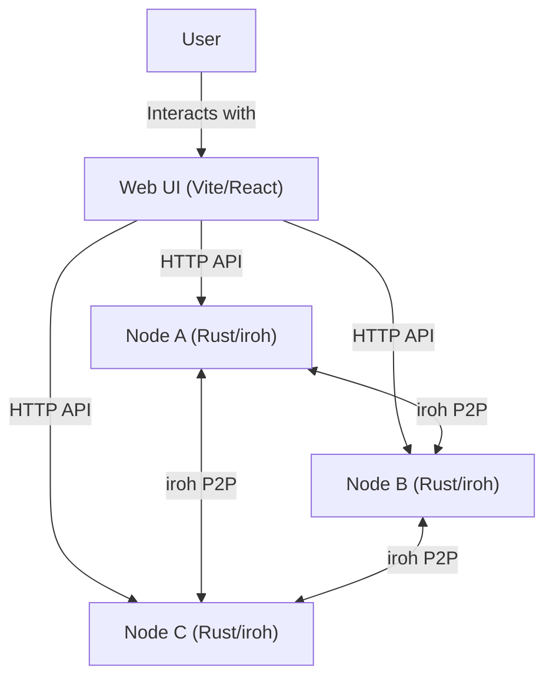
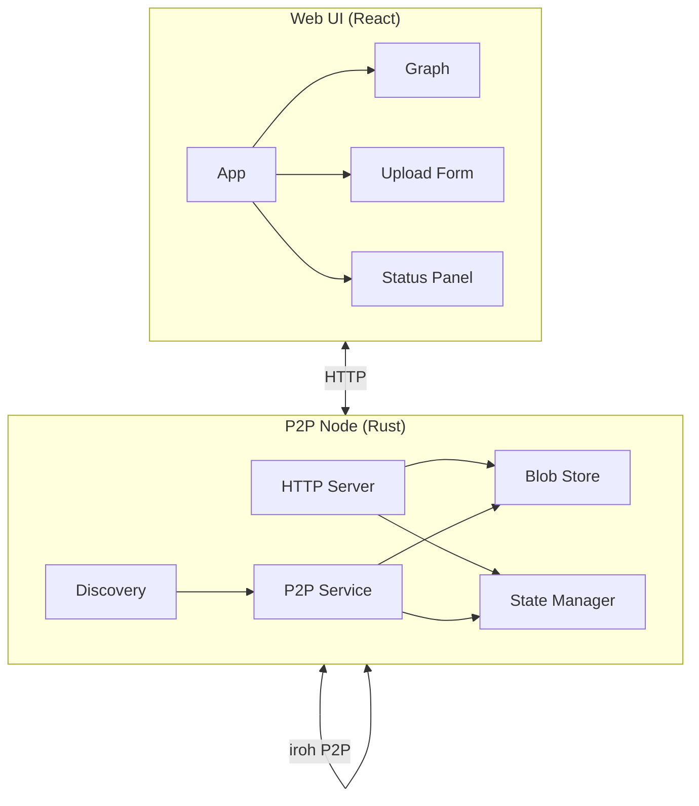
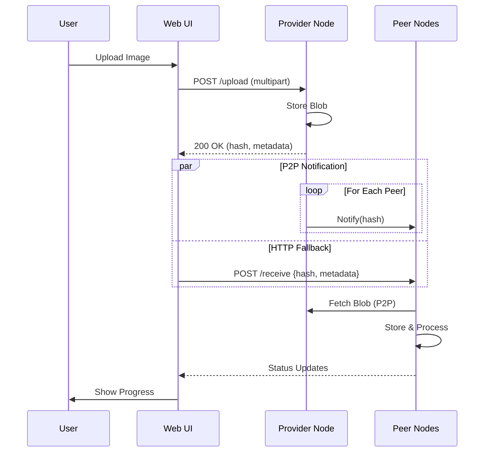
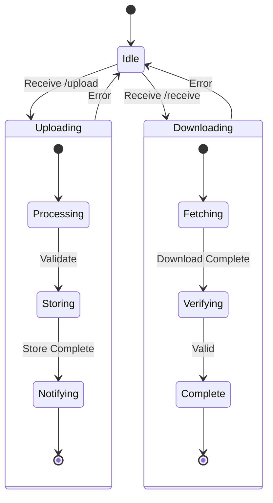
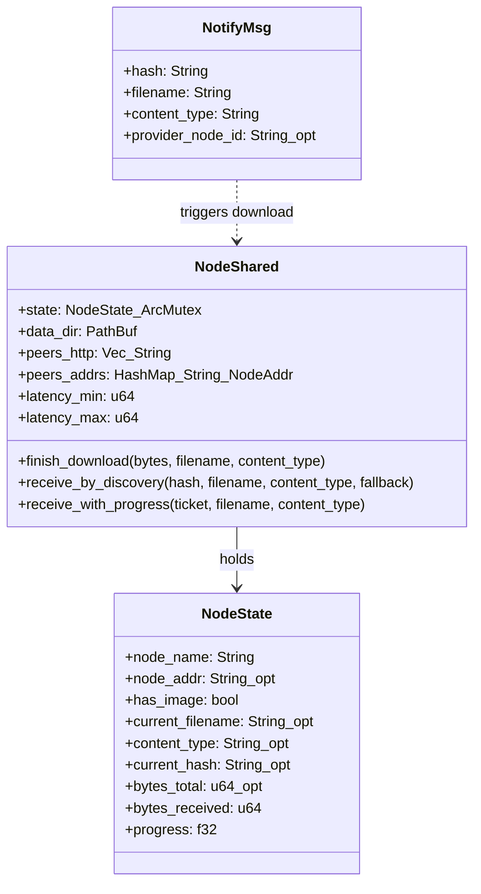
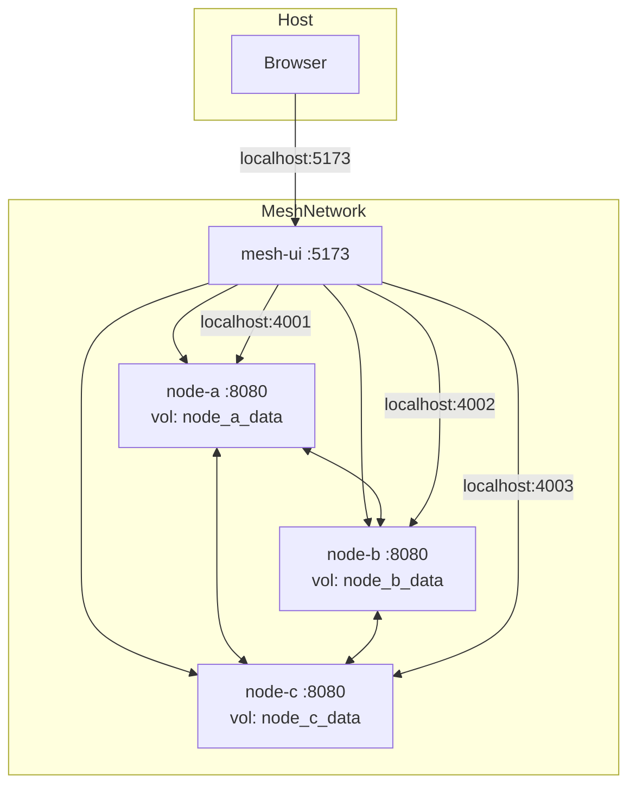
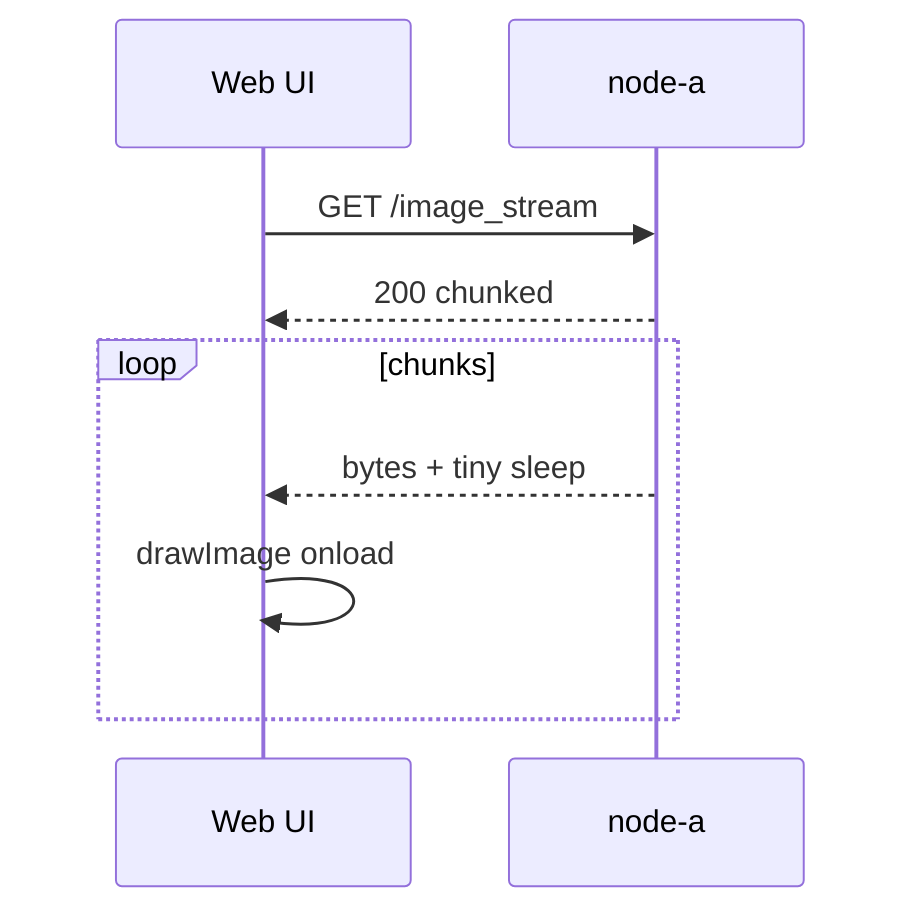

<div align="center">
  <h1>Emerald Image Mesh</h1>
  <p>A peer-to-peer content distribution system built with iroh and React</p>
  
  [](LICENSE)
  [](https://www.rust-lang.org/)
  [](https://nodejs.org/)
  [](https://www.docker.com/)
  
  [](https://example.com/demo)
  [](https://docs.example.com)
  [](CONTRIBUTING.md)
  [](YELLOW.md)
</div>

## Overview

Emerald Image Mesh is a proof-of-concept implementation of a peer-to-peer content distribution system designed for local area networks. It demonstrates efficient content distribution using iroh's P2P capabilities with a focus on observability and user experience.

### Key Features

- 🚀 **Peer-to-Peer Content Distribution**: Direct node-to-node transfers using iroh-blobs
- 🌐 **Web-Based UI**: Real-time monitoring and control through a modern React interface
- 📊 **Live Progress Tracking**: Visual feedback for content distribution across the network
- 🧩 **Stripe Awareness**: Nodes record which peers served each stripe, visible in the UI for troubleshooting
- 🛠 **Developer Friendly**: Comprehensive documentation and development setup
- 🐳 **Containerized Deployment**: Easy setup with Docker Compose
- 🔍 **Observability**: Built-in status endpoints and visual feedback

## 🚀 Quick Start

### Prerequisites

- [Docker](https://docs.docker.com/get-docker/) 20.10.0+
- [Docker Compose](https://docs.docker.com/compose/install/) v2.0.0+
- (For development) Node.js 18+ and Rust 1.70+

### Running with Docker Compose

1. Clone the repository:
   ```bash
   git clone https://github.com/rednaxela5950/prospector-simple.git
   cd emerald-image-mesh
   ```

2. Start the mesh (10 nodes + UI):
   ```bash
   docker compose up --build
   ```

3. Access the web interface at http://localhost:5173

### Demo

[Watch the demo video](https://github.com/rednaxela5950/prospector-simple/raw/refs/heads/master/ScreenRecording.mov)

### Architecture Overview

The deployment consists of:

- **10 P2P Nodes** (node-a through node-j)
  - HTTP APIs on ports 4001-4010
  - iroh P2P communication
  - Local storage for blobs
- **Web UI**
  - Served on port 5173
  - Real-time monitoring and control

## 🖥️ Usage

1. **Upload an Image**:
   - Click "Choose File" and select an image
   - Click "Upload to node-a" to start distribution

2. **Monitor Progress**:
   - The graph shows nodes with progress rings
   - Live previews appear as nodes receive the image
   - Status updates show the current state of each step

3. **View Streams**:
   - Each node's current image is available at `/image`
   - Progressive streaming is available at `/image_stream`

### Stripe Insight

Each node now exposes a `stripe_providers` ledger in `/status`. The UI renders that data so you can see which peers supplied every stripe during a download—handy when testing horizontal scaling or debugging slow nodes.

## ⚙️ Configuration

### Environment Variables

#### Node Configuration

| Variable | Default | Description |
|----------|---------|-------------|
| `ENABLE_LOCAL_DISCOVERY` | `true` | Enable LAN discovery in the iroh endpoint |
| `PEER_HTTP_URLS` | - | Comma-separated list of peer HTTP URLs |
| `LATENCY_MS_MIN` | `0` | Minimum artificial latency in milliseconds |
| `LATENCY_MS_MAX` | `0` | Maximum artificial latency in milliseconds |
| `STREAM_SLEEP_MS` | `10` | Sleep between chunks in image stream (demo) |
| `DATA_DIR` | `/data` | Directory for storing blobs and images |

#### UI Configuration

| Variable | Default | Description |
|----------|---------|-------------|
| `VITE_NODES_JSON` | Predefined | JSON array of node configurations |
| `VITE_POLL_INTERVAL` | `500` | Status polling interval in ms |

### Scaling Nodes

To add more nodes to the mesh:

1. Copy a node service in `docker-compose.yml`
2. Update the port mappings and environment variables
3. Add the new node to `VITE_NODES_JSON` in the UI service

## 📚 Documentation

For detailed documentation, please see:

- [Yellow Paper](YELLOW.md) - High-level design overview with diagrams
- [Code Architecture](docs/CODE_ARCHITECTURE.md) - In-depth technical documentation
- [API Reference](docs/API.md) - HTTP API specifications
- [Development Guide](CONTRIBUTING.md) - Setting up a development environment
- [Security Policy](SECURITY.md) - Reporting vulnerabilities and security best practices

## 🛠 Troubleshooting

### Common Issues

#### LAN Discovery Not Working
If nodes can't discover each other (common on macOS with Docker Desktop):
1. Check that `ENABLE_LOCAL_DISCOVERY=true`
2. Verify nodes can reach each other's HTTP endpoints
3. The system will fall back to HTTP fanout if P2P discovery fails

#### Slow Transfers
- Keep images small (<2MB) for best performance
- Check network connectivity between nodes
- Monitor system resources (CPU, memory, disk I/O)

#### Debugging
1. Check container logs:
   ```bash
   docker compose logs -f
   ```
2. Access node status at `http://localhost:40XX/status`
3. Enable debug logging with `RUST_LOG=debug`

## 🤝 Contributing

We welcome contributions! Please see our [Contributing Guidelines](CONTRIBUTING.md) for details on how to get started.

## 📄 License

This project is licensed under the MIT License - see the [LICENSE](LICENSE) file for details.

## 🙏 Acknowledgments

- Built with [iroh](https://github.com/n0-computer/iroh)
- UI powered by [React](https://reactjs.org/) and [Vite](https://vitejs.dev/)
- Visualization using [react-force-graph-2d](https://github.com/vasturiano/react-force-graph)


## 🏗️ Project Goals

Emerald Image Mesh is an experimental implementation exploring peer-to-peer content distribution concepts. It serves as both a learning tool and a foundation for building more robust distributed systems.

### Core Principles

- **Decentralization**: Direct peer-to-peer transfers without central coordination
- **Observability**: Clear, real-time feedback about system state
- **Resilience**: Graceful degradation when components fail
- **Developer Experience**: Well-documented codebase with clear architecture

### Use Cases

- **Education**: Learn about P2P networking and distributed systems
- **Prototyping**: Rapidly test content distribution concepts
- **Local Collaboration**: Share content within a local network
- **Research**: Experiment with P2P protocols and algorithms

## 🚧 Project Status

This is an **experimental** project and is not yet production-ready. Key limitations include:

### Current Limitations

- **Single Asset Focus**: Only one active image per node
- **LAN-Only**: Optimized for local network use
- **Minimal Security**: No authentication or encryption
- **Basic Error Handling**: Limited recovery from network issues

### Roadmap

Planned improvements include:

1. **Enhanced Security**
   - Peer authentication
   - Content encryption
   - Access control

2. **Improved Reliability**
   - Resumable transfers
   - Multiple content versions
   - Better error recovery

3. **Advanced Features**
   - WAN support with NAT traversal
   - Content pinning and garbage collection
   - Multi-asset support
   - Optional randomized chunk scheduling (prototype in `p2p-node/src/chunk_strategy.rs`), alongside Bao proof delivery for out-of-order chunks so integrity verification still passes.

## 📖 Learn More

For technical details about the implementation, see:

- [Code Architecture](docs/CODE_ARCHITECTURE.md) - In-depth technical documentation
- [Iroh Documentation](https://iroh.computer/) - The P2P networking library powering Emerald
- [Emerald Paper](https://alex.sellstrom.me/papers/Emerald.pdf) - Research paper on the concepts behind this project

## 🏗️ System Architecture

### High-Level Overview



### Component Diagram



### Data Flow

#### Upload Process



### Node Lifecycle



### Key Components

#### P2P Node (`p2p-node/`)
- **HTTP Server**: REST API for UI interaction
- **Blob Store**: Manages content storage and retrieval
- **P2P Service**: Handles peer communication via iroh
- **State Manager**: Tracks node status and transfer progress

#### Web UI (`ui/`)
- **App**: Main application component
- **Graph**: Visualizes the node network
- **Upload Form**: Handles file selection and upload
- **Status Panel**: Shows transfer progress and system state

For more detailed technical information, see the [Code Architecture](docs/CODE_ARCHITECTURE.md) documentation.



### 6) Deployment overview (compose)



### 7) Progressive preview stream (sequence)



