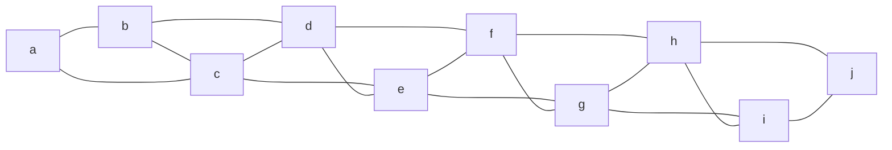

# Mesh Topology

```mermaid
flowchart LR
    A[a]
    B[b]
    C[c]
    D[d]
    E[e]
    F[f]
    G[g]
    H[h]
    I[i]
    J[j]

    %% Core triangle
    A --- B
    B --- C
    C --- A

    %% Chain expansion
    B --- D
    C --- D
    C --- E
    D --- E
    D --- F
    E --- F
    E --- G
    F --- G
    F --- H
    G --- H
    G --- I
    H --- I
    H --- J
    I --- J
```
